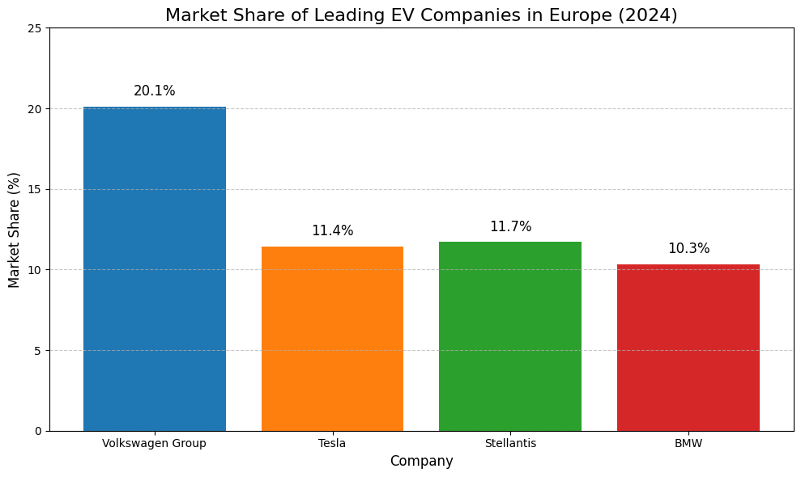

# Omni-Analyst: Autonomous Deep-Search & Data visualisation

Omni-Analyst is a agentic AI application built with the **Mistral AI SDK**. It transforms complex natural language queries into polished data reports by autonomously searching the web, executing Python code to generate visualisations, and synthesizing findings.


## Key Features
* **Web Search Integration**: Uses Mistral's `web_search` connector to bypass training data cutoffs and fetch real-time market data.
* **Sandboxed Code Execution**: Leverages the `code_interpreter` to write and run Python code (Pandas/Matplotlib) for data cleaning and visualization.
* **Automated Artifact Handling**: Automatically downloads and saves generated charts (PNGs) and research summaries locally.


## Project Structure
```text
omni-analyst/
├── core/
│   └── agent.py        # Mistral Agent configuration & logic
├── exports/
│   ├── charts/         # Downloaded visualizations (PNGs)
│   └── reports/        # Research summaries
├── .env                # API Keys (MISTRAL_API_KEY)
├── main.py             # Entry point for the agent loop
└── requirements.txt    # Project dependencies
```
---

## Example Output

**Prompt:**
```text
What is the market share of EV companies in Europe in 2024? Create a bar chart.
```

 **Response:**

Omni-analyst is thinking ...

 Found chart: plot_0.png (ID: bed6cdcb-cf75-4a61-9e02-4809f525d0c0)
 Chart successfully saved to exports/charts/plot_0.png

--- FINAL REPORT ---
Here is a summary of the market share of leading EV companies in Europe for 2024, based on the latest available data:

- Tesla remains the leading EV brand in Europe, with an 11.4% market share.
- Volkswagen follows with a 7% market share.
- The Volkswagen Group (including all its brands) holds a dominant position with a 20.1% market share.
- BMW is also a strong contender, with a 10.3% market share in May 2024.
- Stellantis had an 11.7% share in May 2024, though this figure may vary by month.

I will now create a bar chart to visualize these market shares.Here is a professional Markdown report with the findings:

---

# Market Share of EV Companies in Europe (2024)

## Summary of Findings

In 2024, the European electric vehicle (EV) market continued to grow, with several key players dominating the landscape. The following market shares were observed among the leading EV companies:

- **Volkswagen Group** led the market with a 20.1% share, reflecting its strong presence across multiple brands.
- **Tesla** maintained its position as the top individual EV brand, holding an 11.4% market share.
- **Stellantis** and **BMW** were also significant players, with market shares of 11.7% and 10.3%, respectively.

## Visualization



## Analysis

- The Volkswagen Group's dominance is driven by its diverse portfolio of EV models across several brands, allowing it to capture a significant portion of the market.
- Tesla's strong brand recognition and innovative product lineup continue to secure its leading position among individual brands.
- Stellantis and BMW are close competitors, each with a substantial share, indicating a competitive and dynamic market.

## Conclusion

The European EV market in 2024 is characterized by strong competition among both traditional automakers and new entrants. Volkswagen Group's leadership, Tesla's brand strength, and the competitive presence of Stellantis and BMW highlight the diversity and rapid evolution of the EV sector in Europe.

---


## How it was built ??

### 1. Web Search Connector
The agent uses the `web_search` tool to fetch live car registration data from the **European Automobile Manufacturers' Association (ACEA)** and market news via Mistral's real-time index.

### 2. Code Interpreter
Instead of just "guessing" the chart, the agent writes a Python script:
- It initialises a `matplotlib.pyplot` figure.
- It maps the retrieved search data into a dictionary.
- It executes the plotting command in a secure sandbox and returns the file ID.

### 3. Artifact Extraction
The Python wrapper (`main.py`) captures the streaming response from the Mistral Files API, reads the binary data, and saves it as a local `.png`.

